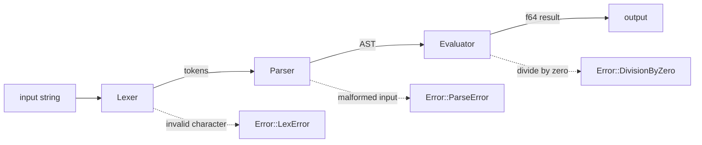

<!-- ══════════════════════════ TITLE ══════════════════════════ -->
<div align="center">
  
</div>

<br/>

<!-- ══════════════════════ IDIOMAS / LANGUAGES ══════════════════════ -->
<div align="center">
<a href="README.md"></a>
<a href="README.en.md"></a>
<a href="README.es.md"></a>
</div>

<br/>

[](https://github.com/geoggrigori/exprcalc/actions/workflows/ci.yml)

[](https://www.rust-lang.org)
[](https://doc.rust-lang.org/cargo)
[](LICENSE)
[](Cargo.toml)

A small, fast arithmetic expression evaluator written in Rust. It takes a string
like `2 + 3 * (4 - 1)`, runs it through a hand-written **lexer**, a
**recursive-descent parser**, and an **evaluator**, and gives you back an `f64`.

The whole crate is **standard library only** — no external dependencies.

## Features

- Numbers (integer and floating point), the operators `+ - * / % ^`, unary
  minus, and parentheses for grouping.
- Correct operator precedence: `^` binds tighter than `* / %`, which bind
  tighter than `+ -`.
- Right-associative exponentiation (`2 ^ 3 ^ 2` evaluates to `512`) and
  right-associative unary minus (`--5` evaluates to `5`).
- A clean `Error` enum (`LexError`, `ParseError` with position, `DivisionByZero`)
  implementing `Display` and `std::error::Error`.
- Usable as a **library** (`pub fn eval(input: &str) -> Result<f64, Error>`) or
  as a **CLI** with both one-shot and REPL modes.
- Fully tested: unit, integration, and documentation tests.

## How it works



## Grammar

The supported grammar, in EBNF-ish form:

```ebnf
expr    = term , { ( "+" | "-" ) , term } ;
term    = power , { ( "*" | "/" | "%" ) , power } ;
power   = unary , [ "^" , power ] ;
unary   = "-" , unary | primary ;
primary = number | "(" , expr , ")" ;
number  = digit , { digit } , [ "." , { digit } ]
        | "." , digit , { digit } ;
digit   = "0".."9" ;
```

Precedence (lowest to highest): additive (`+ -`) → multiplicative (`* / %`) →
exponentiation (`^`) → unary minus → primary. Exponentiation and unary minus
are right-associative; the additive and multiplicative operators are
left-associative. Because unary minus binds tighter than `^`, `-2 ^ 2` parses
as `(-2) ^ 2 = 4`; use `2 ^ (-1)` for a negative exponent.

## Build & install

```sh
cargo build --release
```

The optimized binary is written to `target/release/exprcalc`. You can also
install it onto your `PATH` with:

```sh
cargo install --path .
```

## Usage

**One-shot** — pass the expression as arguments:

```sh
$ exprcalc "2 + 3 * (4 - 1)"
11

$ exprcalc "-(2 + 3) * 4"
-20

$ exprcalc "10 % 3"
1

$ exprcalc "2 ^ 3 ^ 2"
512

$ exprcalc "2 * 3 ^ 2"
18
```

On an error the message goes to stderr and the process exits with status `1`:

```sh
$ exprcalc "1 / 0"
error: evaluation error: division by zero

$ exprcalc "2 +"
error: parse error at position 3: unexpected end of input, expected a number or '('
```

**REPL** — run with no arguments to evaluate expressions line by line until EOF:

```sh
$ exprcalc
> 2 + 2
4
> (1 + 2) * 3
9
> 5 $ 1
error: lex error: unexpected character '$' at position 2
```

### As a library

```rust
use exprcalc::eval;

fn main() {
    match eval("2 + 3 * 4") {
        Ok(value) => println!("= {value}"),
        Err(err) => eprintln!("error: {err}"),
    }
}
```

## Running tests

```sh
cargo test
```

This runs the unit tests (lexer and parser), the integration tests under
`tests/`, and the documentation tests embedded in the API docs.

## License

Released under the [MIT License](LICENSE). Copyright (c) 2026 Geovana Grigorio.
