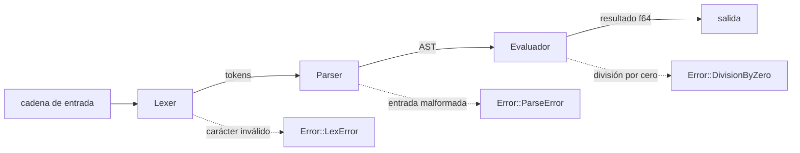

<!-- ══════════════════════════ PORTADA ══════════════════════════ -->
<div align="center">
  
</div>

<!-- ══════════════════════ IDIOMAS / LANGUAGES ══════════════════════ -->
<div align="center">
<a href="README.md"></a>
<a href="README.en.md"></a>
<a href="README.es.md"></a>
</div>

<div align="center">
  
</div>

<h1 align="center">exprcalc</h1>
<p align="center"><em>Evaluador de expresiones aritméticas rápido, escrito en Rust</em></p>
<p align="center"><strong>Lexer → parser recursivo-descendente → evaluador → f64</strong></p>

<div align="center">
<a href="https://github.com/geoggrigori/exprcalc/actions/workflows/ci.yml"></a>


</div>

<div align="center">
<a href="#acerca-de"></a>
<a href="#cómo-funciona"></a>
<a href="#gramática"></a>
<a href="#uso"></a>
</div>

<br/>

> 🦀 **Solo standard library** — cero dependencias externas en todo el crate.

## Acerca de

**exprcalc** es un evaluador de expresiones aritméticas pequeño y rápido, escrito en Rust. Toma una cadena como `2 + 3 * (4 - 1)`, la pasa por un **lexer** hecho a mano, un **parser recursivo-descendente**, y un **evaluador**, y devuelve un `f64`.

**Destacados:**
- Números (enteros y punto flotante), operadores `+ - * / % ^`, menos unario y paréntesis.
- Precedencia correcta: `^` liga más fuerte que `* / %`, que ligan más fuerte que `+ -`.
- Exponenciación y menos unario asociativos a la derecha (`2 ^ 3 ^ 2` = `512`; `--5` = `5`).
- `Error` enum limpio (`LexError`, `ParseError` con posición, `DivisionByZero`).
- Usable como **biblioteca** (`pub fn eval(input: &str) -> Result<f64, Error>`) o **CLI** (modo directo y REPL).
- Totalmente probado: pruebas unitarias, de integración y de documentación.

## Cómo funciona



## Gramática

```ebnf
expr    = term , { ( "+" | "-" ) , term } ;
term    = power , { ( "*" | "/" | "%" ) , power } ;
power   = unary , [ "^" , power ] ;
unary   = "-" , unary | primary ;
primary = number | "(" , expr , ")" ;
```

Precedencia (menor a mayor): aditiva (`+ -`) → multiplicativa (`* / %`) → exponenciación (`^`) → menos unario → primaria. Como el menos unario liga más fuerte que `^`, `-2 ^ 2` = `(-2) ^ 2 = 4`; usa `2 ^ (-1)` para exponente negativo.

## Uso

```sh
cargo build --release      # binario optimizado en target/release/exprcalc
cargo install --path .     # instalar en el PATH
```

**Directo:**
```sh
$ exprcalc "2 + 3 * (4 - 1)"
11
$ exprcalc "2 ^ 3 ^ 2"
512
```

**REPL:**
```sh
$ exprcalc
> 2 + 2
4
```

**Como biblioteca:**
```rust
use exprcalc::eval;
match eval("2 + 3 * 4") {
    Ok(value) => println!("= {value}"),
    Err(err) => eprintln!("error: {err}"),
}
```

**Pruebas:**
```sh
cargo test
```

## Licencia

[MIT](LICENSE).

<div align="center">
  
</div>

<p align="center"><sub>Desarrollado por <strong><a href="https://github.com/geoggrigori">Grigori</a></strong> · 2026</sub></p>
