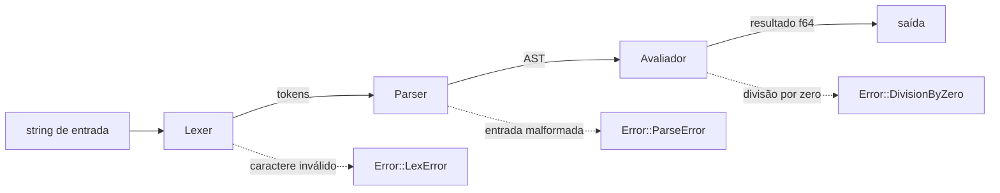

<!-- ══════════════════════════ TÍTULO ══════════════════════════ -->
<div align="center">
  
</div>

<!-- ══════════════════════ IDIOMAS / LANGUAGES ══════════════════════ -->
<div align="center">
<a href="README.md"></a>
<a href="README.en.md"></a>
<a href="README.es.md"></a>
</div>

<div align="center">
  
</div>

<h1 align="center">exprcalc</h1>
<p align="center"><em>Avaliador de expressões aritméticas rápido, escrito em Rust</em></p>
<p align="center"><strong>Lexer → parser recursivo-descendente → avaliador → f64</strong></p>

<div align="center">
<a href="https://github.com/geoggrigori/exprcalc/actions/workflows/ci.yml"></a>


</div>

<div align="center">
<a href="#sobre"></a>
<a href="#como-funciona"></a>
<a href="#gramática"></a>
<a href="#uso"></a>
</div>

<br/>

> 🦀 **Só standard library** — zero dependências externas em todo o crate.

## Sobre

**exprcalc** é um avaliador de expressões aritméticas pequeno e rápido, escrito em Rust. Pega uma string como `2 + 3 * (4 - 1)`, passa por um **lexer** feito à mão, um **parser recursivo-descendente**, e um **avaliador**, e devolve um `f64`.

**Destaques:**
- Números (inteiros e ponto flutuante), operadores `+ - * / % ^`, menos unário e parênteses.
- Precedência correta: `^` liga mais forte que `* / %`, que ligam mais forte que `+ -`.
- Exponenciação e menos unário associativos à direita (`2 ^ 3 ^ 2` = `512`; `--5` = `5`).
- `Error` enum limpo (`LexError`, `ParseError` com posição, `DivisionByZero`).
- Usável como **biblioteca** (`pub fn eval(input: &str) -> Result<f64, Error>`) ou **CLI** (modo direto e REPL).
- Totalmente testado: testes unitários, de integração e de documentação.

## Como Funciona



## Gramática

```ebnf
expr    = term , { ( "+" | "-" ) , term } ;
term    = power , { ( "*" | "/" | "%" ) , power } ;
power   = unary , [ "^" , power ] ;
unary   = "-" , unary | primary ;
primary = number | "(" , expr , ")" ;
```

Precedência (menor pra maior): aditiva (`+ -`) → multiplicativa (`* / %`) → exponenciação (`^`) → menos unário → primária. Como o menos unário liga mais forte que `^`, `-2 ^ 2` = `(-2) ^ 2 = 4`; use `2 ^ (-1)` pra expoente negativo.

## Uso

```sh
cargo build --release      # binário otimizado em target/release/exprcalc
cargo install --path .     # instalar no PATH
```

**Direto:**
```sh
$ exprcalc "2 + 3 * (4 - 1)"
11
$ exprcalc "2 ^ 3 ^ 2"
512
```

**REPL:**
```sh
$ exprcalc
> 2 + 2
4
```

**Como biblioteca:**
```rust
use exprcalc::eval;
match eval("2 + 3 * 4") {
    Ok(value) => println!("= {value}"),
    Err(err) => eprintln!("error: {err}"),
}
```

**Testes:**
```sh
cargo test
```

## Licença

[MIT](LICENSE).

<div align="center">
  
</div>

<p align="center"><sub>Desenvolvido por <strong><a href="https://github.com/geoggrigori">Grigori</a></strong> · 2026</sub></p>
